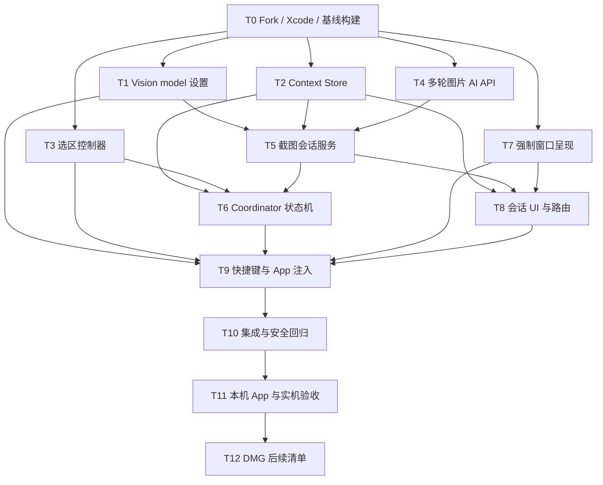

# Peekaboo 截图 AI 会话 MVP · 执行计划

> 方案：已批准的方案 A（App 层专用截图会话链路）  
> 日期：2026-08-31  
> 状态：已批准，执行中  
> 执行方式：TDD，先失败测试，再最小实现，再重构

## 一、前置门禁

以下条件必须在业务实现验证前满足：

1. 当前本地仓库从官方 `main@36413615e1f56f60629bca8718bfe100e4f2c60b` 创建个人 Fork/feature 分支；不向官方 `openclaw/Peekaboo` 推送。
2. 使用 GitHub Actions `macos-15` ARM runner 与预装的 Xcode 26.3（Swift 6.2）；用户本机不安装 Xcode。
3. 远程基线测试与 unsigned Debug build 成功，证明后续错误来自本次改动而非环境。
4. 本机已准备一个支持 Vision 的 provider/API Key 或可用本地视觉模型，用于最终 E2E；凭据不写入仓库和测试。

## 二、任务列表

| ID | 描述 | 输出 | 验收 | 前置依赖 | 预估 | 优先级 | 范围 |
|---|---|---|---|---|---:|---|---|
| T0 | 建立个人 Fork、feature 分支与远程构建流水线，并完成未改基线构建。 | Git remote/branch；GitHub Actions run；`Peekaboo.app.zip`；基线构建记录 | `origin` 指向个人 Fork、`upstream` 指向官方；远程 Mac tests 与 unsigned Debug build 成功；artifact 可下载 | 无 | 0.5d | P0 | dev |
| T1 | 接通 provider-qualified Vision model 设置。 | `Apps/Mac/Peekaboo/Core/Settings.swift`；`Apps/Mac/Peekaboo/Features/Settings/SettingsWindow.swift`；`Apps/Mac/PeekabooTests/Services/SettingsServiceTests.swift` | 设置页选择 provider/model 后可持久化并解析；旧 model-only 配置有明确兼容回退；非 Vision 模型被拒绝 | T0 | 0.5d | P0 | dev |
| T2 | 实现截图会话 context 与图片的本地原子存储。 | `Apps/Mac/Peekaboo/Core/ScreenshotConversation/ScreenshotConversationContextStore.swift`；`Apps/Mac/PeekabooTests/Services/ScreenshotConversationContextStoreTests.swift` | 能创建、恢复、读取、删除 session→PNG 映射；拒绝路径穿越；失败无半写文件；孤儿文件可清理 | T0 | 1d | P0 | dev |
| T3 | 实现可测试的选区几何与多屏 selection controller。 | `Apps/Mac/Peekaboo/Features/CaptureAndAsk/CaptureSelection.swift`；`CaptureSelectionController.swift`；`CaptureSelectionView.swift`；`Apps/Mac/PeekabooTests/Features/CaptureSelectionTests.swift` | 支持任意拖拽方向、负坐标、Retina 逻辑坐标、单屏有效选区和 `Esc`；小于 8pt 不提交；结束后无残留窗口 | T0 | 1d | P0 | dev |
| T4 | 为 AI service 增加多轮图片会话接口与上下文裁剪。 | `Core/PeekabooCore/Sources/PeekabooAutomation/Services/AI/PeekabooAIService.swift`；`Core/PeekabooCore/Tests/PeekabooCoreTests/Services/AI/PeekabooAIServiceTests.swift` | 第一条消息包含原图；保留 user/assistant roles；最多 20 条/32k 字符；显式 Vision model 生效；错误可分类 | T0 | 1d | P0 | dev |
| T5 | 实现截图会话服务，将 SessionStore、context store 与 AI service 串联。 | `Apps/Mac/Peekaboo/Core/ScreenshotConversation/ScreenshotConversationService.swift`；`Apps/Mac/PeekabooTests/Services/ScreenshotConversationServiceTests.swift` | 默认问题自动发送；答案/错误追加到正确 session；每 session 单请求；迟到响应被丢弃；重试复用原图 | T1,T2,T4 | 1d | P0 | dev |
| T6 | 实现 CaptureAndAskCoordinator 状态机与防重入。 | `Apps/Mac/Peekaboo/Core/CaptureAndAskCoordinator.swift`；`Apps/Mac/PeekabooTests/Controllers/CaptureAndAskCoordinatorTests.swift` | 覆盖 Idle→Selecting→Capturing→Presenting→Analyzing→Ready/Error；重复快捷键不创建第二蒙层；取消不建会话、不发 AI | T2,T3,T5 | 1d | P0 | dev |
| T7 | 实现主会话窗口强制呈现并解除截图会话对 Agent mode 的依赖。 | `Apps/Mac/Peekaboo/Core/MainWindowPresenter.swift`；`Apps/Mac/Peekaboo/PeekabooApp.swift`；`Apps/Mac/PeekabooTests/Core/MainWindowPresenterTests.swift`；`PeekabooAppLaunchPolicyTests.swift` | 已有/新建窗口都能激活、切 session、`makeKeyAndOrderFront`；有界重试；Agent mode 关闭时截图会话窗口仍可用 | T0 | 1d | P0 | dev |
| T8 | 在会话 UI 中展示一次截图、加载/错误，并按 session 类型路由追问。 | `Apps/Mac/Peekaboo/Features/Main/SessionChatView.swift`；`Apps/Mac/Peekaboo/Features/Main/ScreenshotConversationHeader.swift`；`Apps/Mac/PeekabooTests/Views/SessionChatRoutingTests.swift` | 截图只显示一次；分析中禁重复提交；追问走截图服务；普通 session 继续走 Agent；新 session 不继承旧图 | T2,T5,T7 | 1d | P0 | dev |
| T9 | 注册 `⌥⌘A` 快捷键、设置项并完成 App 状态注入。 | `Apps/Mac/Peekaboo/Core/KeyboardShortcutNames.swift`；`Apps/Mac/Peekaboo/PeekabooApp.swift`；`Apps/Mac/Peekaboo/Features/Settings/SettingsWindow.swift`；对应快捷键/初始化测试 | 快捷键可配置并立即生效；触发 coordinator；App 启动只创建一套 store/service/coordinator；旧快捷键不变 | T1,T3,T6,T7,T8 | 0.5d | P0 | dev |
| T10 | 完成跨模块集成测试与全量安全回归。 | `Apps/Mac/PeekabooTests/Integration/ScreenshotConversationEndToEndTests.swift`；测试执行记录 | mock 场景覆盖快捷键→选区→截图→窗口→AI→三轮追问；Mac/Core safe tests 全部通过；`git diff --check` 通过 | T9 | 1d | P0 | test |
| T11 | 下载远程构建的 App 并执行真实桌面验收。 | GitHub Actions artifact；本机 `dist/Peekaboo.app`；本机验收记录 | 校验 SHA-256 后解压；完成 10 次截图无重复窗口/串会话；权限、全屏、不同 Space、多屏、网络失败和重启恢复通过；用户可直接启动使用 | T10 | 1d | P0 | test |
| T12 | 记录 DMG/签名后续项，不在本次实现中发布。 | `docs/work/active/2026-08-31-peekaboo-screenshot-ai-chat-mvp/follow-ups.md` | 明确 Bundle ID、个人签名、Notarization、Sparkle 和 DMG 改造清单；不运行官方 release 脚本 | T11 | 0.5d | P2 | release |

所有任务预估均不超过 1 天，满足 execution-plan HARD-GATE。

## 三、依赖图



可并行项：T1、T2、T3、T4、T7 在 T0 后相互独立；但当前执行由单一 agent 完成，按风险优先顺序推进，避免共享 `PeekabooApp.swift` 的冲突。

## 四、TDD 执行顺序

每个 `dev` 任务严格执行：

1. 写最小失败测试并运行，确认失败原因对应尚未实现的行为；
2. 写最小实现使目标测试通过；
3. 运行受影响 package/test target；
4. 重构命名、依赖注入与重复逻辑；
5. 再运行目标测试和相邻回归；
6. 记录命令、通过数和未覆盖的实机边界。

推荐串行顺序：

```text
T0 → T2 → T4 → T1 → T5 → T3 → T7 → T6 → T8 → T9 → T10 → T11
```

T2/T4 先建立存储和 AI 可测试边界；T3/T7 涉及 AppKit 实机行为，在核心服务稳定后接入；T9 最后集中修改 App 注入，降低入口反复返工。

## 五、测试策略

### 5.1 单元测试

| 关注点 | 任务 | 测试方式 |
|---|---|---|
| Vision model 配置/迁移 | T1 | 隔离 UserDefaults，断言 provider-qualified selection |
| context 原子存储 | T2 | 临时目录、失败注入、路径穿越与孤儿清理 |
| 选区几何/状态 | T3 | 纯 CGRect 逻辑 + mock screen/window；AppKit 窗口只做窄测试 |
| 多轮消息与裁剪 | T4 | mock generation client，断言 roles、图片、长度上限与错误 |
| 会话服务 | T5 | mock context/AI/SessionStore，断言消息顺序和 request UUID |
| coordinator | T6 | mock selector/capture/window/service，穷举状态和取消 |
| 窗口呈现 | T7 | fake window locator/opener，断言有界重试和调用顺序 |
| UI 路由 | T8 | store presence/absence 驱动 screenshot/agent 双路由 |
| App 注入/快捷键 | T9 | 单例生命周期、旧快捷键回归 |

### 5.2 集成测试

- mock ScreenCaptureService 返回固定 PNG；
- mock AI service 返回确定答案并支持延迟/错误/取消；
- 验证一次截图会话加三轮追问；
- 验证新普通会话不读取截图 context；
- 重启 store 后恢复 context 与会话关系；
- 删除 session 后清理 PNG 和请求。

### 5.3 实机 E2E

- Screen Recording 首次授权、拒绝、授权后重试；
- 前台普通窗口、macOS 全屏 App、不同 Space；
- 单屏、Retina、多显示器与副屏负坐标；
- 有效 provider、无 Key、断网、超时和取消；
- 连续 10 次截图与 App 重启恢复；
- 确认不请求 Accessibility、不执行自动化工具。

## 六、自然回滚点

| 回滚点 | 完成任务 | 可保留内容 | 回滚动作 |
|---|---|---|---|
| R0：基线 | T0 | Fork、Xcode 与未改 `.app` | 回到官方基线提交 |
| R1：基础能力 | T1-T4 | 独立设置、store、selection、AI API 与测试 | 不注册快捷键；删除新增 App 层文件或回退对应提交 |
| R2：链路可测试 | T5-T7 | 截图服务、状态机、窗口 presenter | 保持入口未暴露；回退 coordinator/wiring |
| R3：用户入口 | T8-T10 | UI、快捷键、集成测试 | 取消 `captureAndAsk` 注册，恢复旧 UI 路由 |
| R4：本机交付 | T11 | `dist/Peekaboo.app` 与验收记录 | 启动上一版基线 App；保留截图目录待用户确认清理 |

本需求无数据库、服务端、Apollo、DDMQ 或远程数据回滚。

## 七、实施边界

- 不在执行中顺手删除 Agent/Bridge/Inspector/CLI；
- 不运行官方 release、notarization 或 DMG 脚本；
- 不把 API Key、截图内容或会话全文写入日志/测试 fixture；
- 不因本机缺 Xcode而假装测试通过；
- 发现旁支缺陷先报告，只有阻断 P0 链路时才纳入当前修复；
- 每个实现阶段完成后先跑对应测试，再进入下一任务。

## 八、批准记录

- 需求提案：已批准。
- 技术方案 A：2026-08-31 用户回复“直接干”，已批准。
- 执行计划：2026-09-01 用户回复“确认执行计划”，已批准。
- 已进入 `tdd-implementation`，从 T0 环境/Fork/基线门禁开始。

## 九、T0 执行记录（2026-09-01）

- 已从官方基线 `36413615e1f56f60629bca8718bfe100e4f2c60b` 建立隔离工作区与分支 `feat/screenshot-ai-chat-mvp`。
- 官方远端已改名为 `upstream`；个人 `origin` 暂未添加，因为本机 GitHub CLI 登录凭据失效，个人 Fork 尚未创建成功。
- 五个 Git submodule 已从原工作区本地副本初始化，未修改依赖版本。
- 本机 baseline unsigned Debug build 已执行并按预期失败：当前只有 `/Library/Developer/CommandLineTools`，没有完整 Xcode。
- 本机 Swift package 测试门禁已执行并按预期失败：仓库要求 Swift tools 6.2，本机为 Swift 6.1.2。
- 2026-09-01 用户确认“不装 Xcode，走远程构建”；测试与打包门禁迁移到 GitHub Actions `macos-15` ARM runner。
- 个人 Fork `xhjiang1998/Peekaboo`、远程 `origin` 和分支 `feat/screenshot-ai-chat-mvp` 已创建；后续生产代码仍须先在远程观察失败测试，再补最小实现。
- 远程基线 run `33511362244` 已通过：Mac tests、unsigned App build、打包与 artifact 上传全部成功。
- 基线 artifact 已下载到 `.artifacts/baseline-33511362244/Peekaboo.app.zip`，SHA-256 校验值为 `af6f3bb0567c3f200da0369b53dda5725214ad6facacad29e2a4a9973450c74c`。
