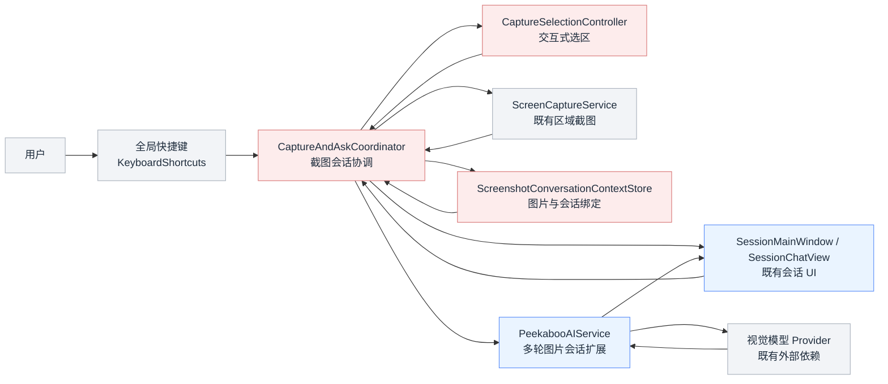
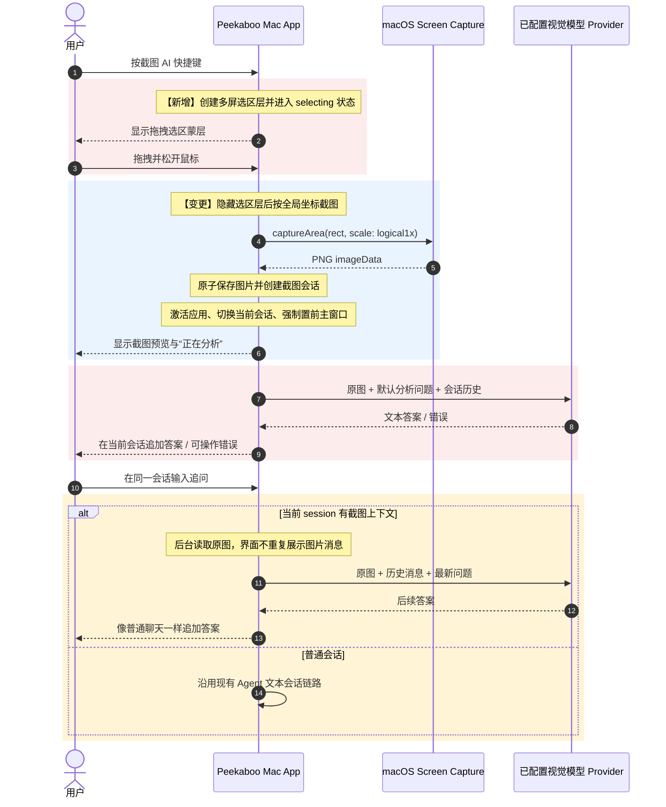
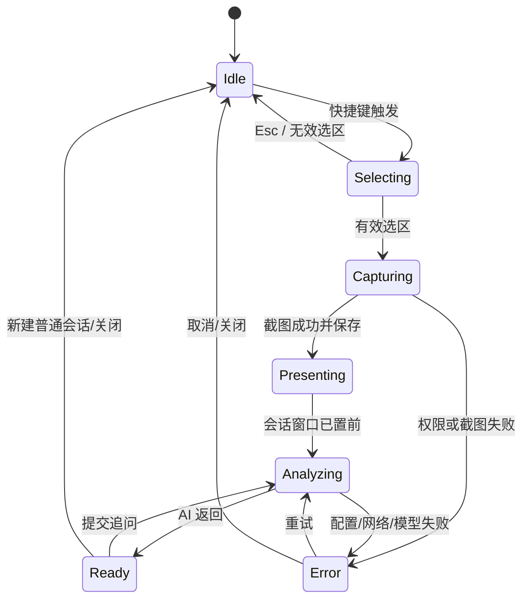

# Peekaboo 截图 AI 会话 MVP · 系统设计

> PRD 来源：[`proposal.md`](./proposal.md)  
> 业务上下文：macOS 桌面工具 / 本机截图 / 视觉问答  
> 设计时间：2026-08-31  
> 版本：v1.0  
> Profile：lite  
> 代码事实来源：本地官方仓库 `main@36413615e1f56f60629bca8718bfe100e4f2c60b`；未使用 GitNexus，采用 `rg` 与源码逐段核查

## 〇、版本记录

| 版本 | 日期 | 变更内容 | 状态 |
|---|---|---|---|
| v1.0 | 2026-08-31 | 初始技术方案 | 已批准方案 A |

## 一、参与人员

| 角色 | 人员 | 职责 |
|---|---|---|
| 产品/验收 | 用户本人 | 确认交互并在本机验收 |
| 技术设计/开发 | Codex | 方案、实现、测试与本机交付 |
| 测试 | 用户本人 + Codex | 自动化验证与实际桌面验收 |
| 外部依赖 | 用户配置的 AI provider | 视觉模型推理 |

## 二、需求背景

### 2.1 背景与目标

当前 Peekaboo Mac App 已有可持续输入的 `SessionMainWindow` / `SessionChatView`、区域截图协议和视觉分析服务，但没有交互式拖拽选区入口。现有 `⇧⌘Space` 只打开 Agent 输入弹窗，不能直接截图；`PeekabooAgent` 的图片分支最终只把图片描述为 `[Image message]` 并执行文本任务，无法可靠保留原图上下文。

本次目标是在保留现有会话 UI 的前提下，新增一条确定、只读、无需命令行的截图会话链路：

> 全局快捷键 → 拖拽选区 → 自动截图 → 强制显示会话窗口 → 自动视觉分析 → 同一会话继续追问

本地 UI 指标：快捷键后 500 毫秒内出现选区层；选区完成后正常环境下 1 秒内置前会话窗口并展示加载状态。外部 AI 返回耗时不纳入 1 秒指标。

### 2.2 需求范围

本次需求包含：

- 可配置截图快捷键和交互式选区；
- 区域截图、图片本地持久化与会话绑定；
- 截图后主窗口激活、切换当前会话和加载展示；
- 默认问题的自动视觉分析；
- 截图会话中的连续文字追问；
- 权限、模型、网络、并发和恢复处理；
- 本机 Debug `.app` 构建与验证。

本次需求不包含：

- 正式 DMG、Developer ID、Notarization、Sparkle 更新；
- 窗口智能选择、全屏模式、跨显示器边界的单个矩形选区；
- 点击、输入、Shell 或其他桌面自动化；
- 删除 CLI、Bridge、Inspector、Visualizer 等既有模块；
- 新建云端业务服务或代理用户的 API Key。

### 2.3 已知源码约束

| 约束 | 当前实现 | 设计影响 |
|---|---|---|
| 快捷键 | 只有 popover、main、Inspector 三个入口 | 新增独立 `captureAndAsk`，不复用旧语义 |
| 主窗口 | `showMainWindow()` 会激活 App 并置前，但受 Agent mode gate 限制 | 截图会话 UI 必须脱离 Agent mode gate |
| 会话 | `ConversationMessage` 只持久化文本/音频 | 图片上下文使用 App 层独立存储，避免改共享 Core 模型 |
| 图片 Agent 输入 | App 包装层把 `.image` 退化为 `[Image message]` | 不走通用 Agent 初始图片链路 |
| 视觉分析 | `PeekabooAIService.analyzeImageDetailed` 支持 PNG + 问题 | 扩展为带历史消息的截图会话分析 |
| Vision 设置 | UI 保存 model ID，但没有传给 AI service，且没有 provider 信息 | 增加 provider-qualified vision selection |
| 构建 | 机器只有 Command Line Tools / Swift 6.1.2；manifest 要求 6.2 | 完整 Xcode 是实现验证的前置条件 |

## 三、架构方案

### 3.1 候选方案对比与选型

#### 方案 A：App 层专用截图会话链路（推荐）

核心思路：新增 `CaptureAndAskCoordinator`、交互式选区控制器和 App 层 `ScreenshotConversationContextStore`。截图与会话绑定后，直接调用扩展后的 `PeekabooAIService`；`SessionChatView` 根据 session 是否存在截图上下文，选择截图会话服务或原 Agent 服务。

改动范围：Mac App 快捷键、窗口、会话 UI、App 层存储；Core AI service 增加一个多轮图片会话方法。复用既有截图服务、provider 配置和主窗口。

优点：

- 路径确定，截图后必然分析，不依赖 Agent 自主选工具；
- 不暴露点击、Shell 等自动化能力；
- 不修改共享 `ConversationSession` / `ConversationMessage` Codable 模型；
- 普通 Agent 会话与截图会话可以共存；
- 最符合本机紧急 MVP 的改动边界。

缺点：

- 截图会话与 Agent 会话存在两条执行路径；
- stateless provider 下，后续追问需要后台再次携带原图和历史消息；
- 第一版答案按完整响应追加，不承诺 token 级流式输出。

风险等级：中。

#### 方案 B：把通用 Agent 改造成原生多模态入口

核心思路：扩展 `AgentServiceProtocol` 和 `PeekabooAgentService`，让初始任务直接接受由文本和图片组成的 `ModelMessage`，再通过 Agent session manager 持久化多模态上下文。

改动范围：Agent 协议、Agent session、streaming、tool filters、App wrapper、共享会话模型和相关测试。

优点：

- 截图与普通 Agent 理论上只保留一条会话执行链路；
- 可复用 Agent streaming 和 server-side session 能力。

缺点：

- 涉及 Core/AgentRuntime 的公共协议和持久化语义，回归面明显更大；
- 必须严格过滤 UI 自动化和 Shell，否则与“只截图、只回答”目标冲突；
- 当前图片输入明确被降级，改造不是简单接线；
- 不利于最快本机落地。

风险等级：高。

#### 选型结论

选择 **方案 A**。本次需求的关键不是扩展通用自动化 Agent，而是稳定交付一个确定性的截图问答产品入口。方案 A 复用已验证的截图、AI 和会话 UI，同时把改动控制在 Mac App 与一个窄 AI API 内；后续如果需要统一多模态 Agent，再单独演进方案 B。

### 3.2 整体架构图



图中标记说明：

- 浅红：本次新增的选区、协调和截图会话上下文能力；
- 浅蓝：本次修改的会话 UI 与 AI service；
- 浅灰：直接复用的用户入口、快捷键库、截图服务和 provider。

### 3.3 核心链路时序图



### 3.4 状态机



### 3.5 服务影响全景

| 模块 | 层级 | 改动强度 | 置信度 | 主要改动 |
|---|---|---:|---:|---|
| Mac App 生命周期与快捷键 | 客户端入口 | 中 | 高 | 注入协调器、新快捷键、窗口呈现 |
| CaptureSelectionController | 客户端 UI | 新增 | 高 | 多屏选区面板、鼠标与 Esc |
| ScreenCaptureService | 基础能力 | 低 | 高 | 仅复用 `captureArea`，不改协议 |
| ScreenshotConversationContextStore | 本地存储 | 新增 | 高 | session → image 文件映射 |
| SessionMainWindow / SessionChatView | 会话 UI | 中 | 高 | 截图会话展示、路由、加载与错误 |
| PeekabooAIService | AI 基础能力 | 中 | 高 | 多轮图片会话、显式视觉模型 |
| PeekabooSettings | 配置 | 低 | 高 | provider-qualified vision model |
| 通用 Agent / Bridge / CLI | 既有能力 | 无 | 高 | 本次不改，不作为截图主链路依赖 |

## 四、专题分析

### 4.1 灰度方案

本需求不涉及 Apollo 或服务端流量灰度。新入口采用独立快捷键，未触发时不改变原有 Agent 会话行为；它本身就是天然隔离边界。

回退时可取消 `captureAndAsk` 快捷键注册并隐藏相关设置，原有三个快捷键和 Agent 会话保持不变。

### 4.2 数据一致性

| 场景 | 一致性要求 | 实现方案 | 异常处理 |
|---|---|---|---|
| 截图文件与 context 元数据 | 同一进程内一致 | 先原子写 PNG，再原子写 context JSON，最后创建会话 | 任一步失败则清理已写临时文件，不发送 AI |
| context 与 SessionStore | 最终一致 | context 以 session ID 关联；加载时过滤不存在的文件/会话 | 显示“原截图已丢失”，普通历史文本仍可读 |
| AI 答案与当前会话 | 强绑定 | 每次请求携带 session ID + request UUID，返回时双重校验 | 丢弃过期或已切换/删除会话的结果 |
| 删除截图会话 | 最终一致 | 删除 session 后同步删除 context 和 PNG | 删除失败记录日志，下次启动清理孤儿文件 |

### 4.3 AB 实验方案

本需求不涉及 AB 实验。

### 4.4 数据迁移方案

本需求不修改既有 `sessions.json` 格式，不需要存量会话迁移。新增 `screenshot-contexts.json` 为空时按无截图会话处理。

### 4.5 隐私与安全

- 只有用户按快捷键并完成选区后才截图；
- 不使用剪贴板监听、目录监听或后台连续观察；
- 截图仅保存到用户 Application Support 下，不写入日志或 `sessions.json` 的 base64；
- 发送给用户选择的 AI provider 前不扩大为整屏；
- Screen Recording 是主链路唯一必需的系统隐私权限；
- 截图会话不调用通用 Agent 的点击、输入、Shell 等工具；
- 删除会话时删除对应本地截图；
- 正式对外分发前另行评估静态文件加密，本机单用户 MVP 暂不加密。

## 五、详细设计

### 5.1 CaptureAndAskCoordinator

#### 5.1.1 改动概述

| 改动点 | 类型 | 说明 |
|---|---|---|
| 协调状态机 | 新增 | 管理选区、截图、呈现、分析和重试 |
| 快捷键入口 | 新增 | `captureAndAsk`，建议默认 `⌥⌘A`，设置页可修改 |
| 防重入 | 新增 | Selecting/Capturing 时忽略重复快捷键；Analyzing 不阻塞新截图会话 |
| 窗口呈现 | 新增 | 在截图成功后切换 session 并强制置前主窗口 |

#### 5.1.2 关键逻辑

1. 快捷键只投递到 `@MainActor` coordinator，不在回调内直接截图。
2. 检查 Screen Recording；未授权时创建错误会话、置前主窗口并提供权限入口。
3. 调用 selection controller 等待矩形或取消。
4. 关闭所有选区窗口，再调用 `captureArea(rect, visualizerMode: .none, scale: .logical1x)`，避免蒙层进入截图。
5. 将图片原子写入 Application Support 临时文件，再 rename 为 `<sessionID>.png`。
6. 创建/选中会话，保存 context，追加用户截图占位消息。
7. 调用 `forceShowMainWindow()`；窗口出现后设置当前 session。
8. 发起 AI 请求，返回时校验 request UUID 和 session 仍存在，再追加 assistant 消息。

#### 5.1.3 并发与幂等

- 全局最多一个 selection/capture task；
- 每个 screenshot session 最多一个 AI task；提交期间输入框禁用并显示取消按钮；
- coordinator 保存 `[sessionID: Task]`，窗口关闭不取消请求，删除 session 会取消；
- response 必须同时匹配 session ID 与 request UUID，防止串会话；
- `Esc` 只取消选区；AI 请求使用现有取消语义或丢弃迟到结果。

### 5.2 CaptureSelectionController

#### 5.2.1 窗口策略

- 每个 `NSScreen` 创建一个透明、无边框、可接收鼠标的 `NSPanel`；
- level 使用 `.screenSaver` 或经验证足够的最高非系统级别；
- `collectionBehavior = [.canJoinAllSpaces, .stationary, .fullScreenAuxiliary]`；
- 与现有 Overlay 不共享实例，因为现有实现明确 `ignoresMouseEvents = true`；
- 鼠标按下所在屏幕成为 active screen，MVP 单个选区不得跨显示器边界；其他显示器仍显示蒙层并可开始新的选区。

#### 5.2.2 坐标规则

- 选择层内部使用 window-local 坐标；
- 完成时通过 `window.convertToScreen` 输出 AppKit 全局坐标；
- 使用标准化矩形兼容从右下向左上拖拽；
- 宽或高小于 8 points 视为无效；
- 保留负数全局坐标，不自行平移到主屏原点；
- 截图结果以 `captureArea` 返回的 imageData 为准，不二次裁剪。

#### 5.2.3 交互

- 光标变为 crosshair；
- 蒙层变暗，选中区透明并显示 1px 边框；
- `Esc` 取消，鼠标松开确认；
- 选区完成立即隐藏并释放面板，避免遮挡截图或抢占会话窗口焦点。

### 5.3 ScreenshotConversationContextStore

#### 5.3.1 设计选择

不修改共享 `ConversationSession` / `ConversationMessage` Codable 模型。App 层新增独立 context store，以 session ID 判断会话类型。这能避免旧 `sessions.json` 解码风险，也不影响 CLI/AgentRuntime。

#### 5.3.2 数据结构

```swift
struct ScreenshotConversationContext: Codable, Sendable {
    let sessionID: String
    let imageFileName: String
    let createdAt: Date
    let captureRect: CodableRect
    let displayID: UInt32?
    var lastProvider: String?
    var lastModel: String?
}
```

存储目录：

```text
~/Library/Application Support/Peekaboo/
├── sessions.json
└── ScreenshotConversations/
    ├── contexts.json
    └── Images/
        └── <session-id>.png
```

`contexts.json` 只存相对文件名，不存绝对用户路径和图片 base64。

#### 5.3.3 生命周期

- 启动：加载 context，过滤路径穿越、缺失图片和非法 session ID；
- 创建：原子写图片和 JSON；
- 读取：按 session ID 返回 context 与图片 Data；
- 删除：先取消请求，再删 context，最后删除 PNG；
- 清理：启动时删除无 context 引用的临时文件和孤儿 PNG。

### 5.4 截图会话 AI 服务

#### 5.4.1 多轮消息

在 `PeekabooAIService` 增加窄接口，接受：原始 PNG、当前 screenshot session 的文本 turns、显式 vision model。服务将第一条用户消息组装为“默认问题 + 图片”，后续 turns 保留 user/assistant role，最后调用 Tachikoma。

用户界面不会在每条追问中重复显示截图，但由于当前 provider 调用是 stateless 的，后台会在每次截图会话请求中保留原图。这样才能可靠回答“左下角数字是什么”这类首次摘要未覆盖的问题。

为控制上下文：

- 最多携带最近 20 条 user/assistant 消息；
- 单条消息最多 8,000 字符，总文本最多 32,000 字符；
- system/tool/状态消息不发送给 provider；
- 图片使用 `logical1x` PNG；若实测超过 provider 限制，再复用/抽取现有 1600px、4MB 图片归一化逻辑。

#### 5.4.2 默认提示词

```text
请分析这张截图，提取关键信息并给出可直接使用的结论。
如果截图包含题目、报错、文档或界面问题，请直接回答或解释；
如果信息不足，请明确指出缺失信息。不要执行任何桌面操作。
```

#### 5.4.3 Vision model 选择

新增 provider-qualified selection：

- `useCustomVisionModel == false`：由 `PeekabooAIService` 选择 provider 列表中第一个可用且支持 vision 的模型；
- `true`：设置页同时保存 `customVisionProvider` 与 `customVisionModel`，组合后通过 `resolveConfiguredModel` 解析；
- 旧版本只有 model ID：优先在当前 selected provider 下解析，失败则回退自动选择；
- 解析出的模型不支持 vision 时在会话内报错，不静默使用文本模型。

### 5.5 SessionMainWindow / SessionChatView

#### 5.5.1 主窗口可用性

当前主窗口完全受 `agentModeEnabled` 控制。本次调整为：

```text
会话 UI 可用 = screenshot AI 功能启用 OR Agent mode 启用
```

因此用户即使关闭自动化 Agent，也能使用截图 AI 会话。

#### 5.5.2 强制显示

`forceShowMainWindow(sessionID:)` 执行：

1. 先把 `SessionStore.currentSession` 切到截图 session；
2. `DockIconManager.shared.temporarilyShowDock()`；
3. `NSApp.activate(ignoringOtherApps: true)`；
4. 对已有窗口设置 `.moveToActiveSpace`，调用 `makeKeyAndOrderFront` + `orderFrontRegardless`；
5. 新窗口通过 `windowOpener` 创建后，使用最多 10 次、每次 50ms 的有界查找完成同样置前动作；
6. 不永久设置 floating level；“Keep main window on top”仍由现有用户设置控制。

全屏 App、不同 Space、多显示器属于必须实机验证的 P0 场景。macOS 的系统级安全窗口不能被普通 App 覆盖，这不计为功能失败。

#### 5.5.3 会话展示与输入路由

- screenshot context 存在：顶部/首条消息显示一次截图缩略图，输入提交给 screenshot conversation coordinator；
- context 不存在：保持现有 `PeekabooAgent.executeTask(text)`；
- 分析中：显示 loading，禁用重复发送，保留取消；
- 失败：追加可重试错误卡片，不把内部路径/API Key 写入 UI；
- 新建普通会话：不创建 screenshot context，自然切回 Agent 文本会话。

### 5.6 错误处理

| 错误 | 用户文案 | 操作 |
|---|---|---|
| Screen Recording 未授权 | 需要屏幕录制权限才能截取选区 | 打开系统设置 / 取消 |
| 选区无效 | 选区太小，请重新截图 | 重试 |
| 截图失败 | 截图失败，请重试 | 重试 |
| 图片保存失败 | 无法保存截图，请检查磁盘空间 | 重试 / 关闭 |
| 未配置视觉模型 | 请先在 Settings → Providers 配置支持图片的模型 | 打开设置 |
| 模型不支持 Vision | 当前模型不能分析图片 | 选择模型 |
| 网络/Provider 失败 | AI 分析失败：简化后的错误原因 | 重试 |
| 图片上下文丢失 | 原截图已丢失，请重新截图 | 新截图 |
| 请求取消 | 已停止分析 | 重试 |

## 六、接口设计汇总

### 6.1 外部接口

本需求不新增 HTTP、RPC 或公共网络接口。外部 AI 调用沿用 Tachikoma/provider 的既有实现和凭据管理。

### 6.2 新增内部 Swift 接口

#### 6.2.1 选区接口

```swift
@MainActor
protocol CaptureAreaSelecting: AnyObject {
    func selectArea() async throws -> CaptureSelection?
    func cancel()
}
```

| 字段 | 类型 | 必填 | 说明 |
|---|---|---|---|
| 返回值 | `CaptureSelection?` | 否 | `nil` 表示用户取消 |
| `rect` | `CGRect` | 是 | AppKit 全局逻辑坐标 |
| `displayID` | `CGDirectDisplayID?` | 否 | 调试与多屏校验 |

#### 6.2.2 协调接口

```swift
@MainActor
protocol CaptureAndAskCoordinating: AnyObject {
    func startCapture()
    func sendFollowUp(_ text: String, sessionID: String)
    func retry(sessionID: String)
    func cancel(sessionID: String)
}
```

#### 6.2.3 上下文存储接口

```swift
@MainActor
protocol ScreenshotConversationContextStoring: AnyObject {
    func create(sessionID: String, imageData: Data, selection: CaptureSelection) throws
    func context(for sessionID: String) -> ScreenshotConversationContext?
    func imageData(for sessionID: String) throws -> Data
    func delete(sessionID: String) throws
}
```

#### 6.2.4 AI 接口

```swift
public struct ImageConversationTurn: Sendable {
    public let role: MessageRole
    public let text: String
}

public func analyzeImageConversation(
    imageData: Data,
    turns: [ImageConversationTurn],
    model: LanguageModel? = nil
) async throws -> AnalysisResult
```

#### 6.2.5 内部错误码

| 错误 | 触发条件 | 处理方式 |
|---|---|---|
| `selectionCancelled` | 用户按 Esc | 静默回 Idle |
| `selectionTooSmall` | 宽/高小于 8pt | 提示重选 |
| `screenRecordingDenied` | TCC 未授权 | 会话错误 + 设置入口 |
| `captureFailed` | screenshot service 报错 | 会话错误 + 重试 |
| `contextPersistenceFailed` | PNG/JSON 写入失败 | 清理临时文件，不发 AI |
| `imageContextMissing` | context 或 PNG 缺失 | 要求重新截图 |
| `visionModelUnavailable` | 无可用 vision model | 打开 Provider 设置 |
| `analysisFailed` | provider/network/model 错误 | 保留会话与截图，允许重试 |
| `staleResponse` | request UUID 不匹配 | 丢弃，不更新 UI |

## 七、DDMQ 消息设计

> 本需求不涉及 DDMQ 消息变更。

## 八、环境与平台配置变更

### 8.1 应用配置变更

本需求不涉及 dev/sim/pre/prod 环境配置目录。新增设置通过 `UserDefaults` / KeyboardShortcuts 自有存储保存：

| 配置 | 类型 | 默认值 | 说明 |
|---|---|---|---|
| `captureAndAsk` | KeyboardShortcuts | `⌥⌘A` | 可在 Settings → General → Shortcuts 修改 |
| `useCustomVisionModel` | Bool | 既有值 | 是否覆盖自动 vision model |
| `customVisionProvider` | String? | `nil` | 新增，独立视觉模型 provider |
| `customVisionModel` | String | 既有值 | 视觉模型 ID |

### 8.2 Apollo 配置变更

本需求不涉及 Apollo、开关或服务端灰度配置。

## 九、稳定性设计

### 9.1 系统稳定性

- 全局 capture gate 防止重复蒙层；
- session 级 task map 防止同一会话并发请求；
- 选区窗口在任何成功、取消、错误路径都必须释放；
- 文件使用临时路径 + 原子 rename，避免半写 PNG/JSON；
- 迟到响应通过 request UUID 丢弃；
- App 启动时清理临时文件和孤儿 context；
- provider 失败不影响会话窗口、历史消息和下一次截图。

### 9.2 业务稳定性

- 截图失败绝不改传整屏；
- 普通 Agent 会话与截图会话按 context 存在性显式路由；
- context 丢失时停止视觉追问并要求重新截图，不伪造图片理解；
- 新建普通会话不继承截图；
- 首次 AI 失败后保留截图，可原地重试。

### 9.3 资金安全

本需求不涉及资金、支付或账务。

### 9.4 性能评估

单机单用户，设计并发上限为 1 个选区任务、每个 session 1 个 AI 请求。目标：

| 指标 | 目标 | 说明 |
|---|---:|---|
| 快捷键到选区层 | P95 ≤ 500ms | 纯本地 UI |
| 选区完成到窗口 loading | P95 ≤ 1s | 包含本地截图与持久化，不含 AI |
| context JSON 写入 | P95 ≤ 100ms | 单用户小文件 |
| 截图文件大小 | 观察值，建议 ≤ 10MB | 超限后再加入预处理 |
| AI 响应 | 记录但不设硬 SLA | 受 provider、网络、模型影响 |

历史上下文上限 20 条 / 32,000 字符，避免请求随长期聊天无限增长。

### 9.5 新老兼容

- 不改 `sessions.json` schema，旧会话无需迁移；
- 新 context store 缺失视为空；
- 旧 vision model 设置缺 provider 时按兼容规则解析；
- 原有三个快捷键与 Agent 会话保持行为不变；
- screenshot UI 可在 Agent mode 关闭时独立使用。

### 9.6 上下游依赖

| 依赖 | 失败影响 | 处理 |
|---|---|---|
| Screen Recording / ScreenCaptureKit | 无法截图 | 明确权限提示，不发 AI |
| 本地磁盘 | 无法保存上下文 | 明确磁盘错误，不创建残缺会话 |
| AI provider/API Key | 无法分析 | 保留截图、允许配置后重试 |
| KeyboardShortcuts | 无法触发入口 | 设置页可录制，冲突时提示用户修改 |
| 完整 Xcode / Swift 6.2 | 无法构建验证 | 开发前置阻塞，必须先解决 |

### 9.7 监控与告警

本机 MVP 不建设远程监控平台，使用 `os.Logger` + Signpost，禁止记录图片、问题全文、API Key 和绝对敏感路径。

| 监控项 | 指标/日志 | 本机告警条件 | 用户反馈 |
|---|---|---|---|
| 快捷键响应 | `capture.overlay.latency_ms` | > 500ms | 无弹窗则可重试 |
| 截图到窗口 | `capture.window.latency_ms` | > 1000ms | loading 仍必须出现 |
| 截图失败 | `capture.failure` 分类 | 单次即记录 | 会话错误卡片 |
| AI 成功率 | `analysis.success/failure` | 单次失败即展示 | 重试/设置入口 |
| AI 耗时 | `analysis.duration_ms` | > 60s 显示“仍在分析” | 可取消 |
| orphan 清理 | `context.orphan_count` | 启动发现 > 0 | 自动清理并记录 |

### 9.8 限流策略

不新增服务端限流。客户端同一截图会话最多一个在途请求；重复提交按钮禁用。

## 十、定时任务

> 本需求不涉及定时任务变更。

孤儿文件清理发生在 App 启动和会话删除时，不是定时任务。

## 十一、数据库 DDL 变更

> 本需求不涉及数据库 DDL 变更。

本地新增 JSON + PNG 文件，不使用 SQLite/CoreData。

## 十二、测试要点

### 12.1 核心测试场景

| # | 场景 | 前置条件 | 预期结果 | 优先级 |
|---:|---|---|---|---|
| 1 | 快捷键进入选区 | App 运行 | 500ms 内出现选区层 | P0 |
| 2 | 有效选区 | 已授权 Screen Recording | 截图成功，1s 内会话置前并 loading | P0 |
| 3 | Esc 取消 | 选区层可见 | 不创建会话、不写文件、不发请求 | P0 |
| 4 | 自动分析 | 有可用 vision model | 默认提示词自动发送，答案进入当前会话 | P0 |
| 5 | 连续三轮追问 | 截图会话 Ready | 无需用户重传图片，答案可引用原图 | P0 |
| 6 | 新建普通会话 | 已存在截图会话 | 不携带旧图，走 Agent 文本路由 | P0 |
| 7 | 强制弹窗 | 前台为其他 App/不同 Space | 会话窗口切到前台并成为 key window | P0 |
| 8 | 多屏/Retina/负坐标 | 连接多显示器 | 选区与截图像素内容一致 | P0 |
| 9 | 权限未授权 | Screen Recording denied | 不截图，窗口显示权限入口 | P0 |
| 10 | provider 错误 | 无 key/网络断开 | 保留图片和会话，可重试 | P0 |
| 11 | 重复快捷键 | Selecting/Capturing | 只有一个选区实例 | P1 |
| 12 | 连续 10 次截图 | 正常环境 | 无重复窗口、串会话、崩溃 | P1 |
| 13 | 重启恢复 | 已有截图会话 | session 与原图重新关联 | P1 |
| 14 | 删除截图会话 | context/PNG 存在 | 会话、context、PNG 一并删除 | P1 |
| 15 | 旧 sessions.json | 升级前会话数据 | 正常读取，无迁移失败 | P1 |

### 12.2 自动化测试分层

- `CaptureSelectionControllerTests`：矩形标准化、最小区域、多屏坐标、取消；
- `CaptureAndAskCoordinatorTests`：状态机、防重入、request UUID、窗口调用顺序；
- `ScreenshotConversationContextStoreTests`：原子写、恢复、孤儿清理、路径校验；
- `ScreenshotConversationServiceTests`：history 裁剪、role 转换、vision model、错误映射；
- `SessionChatRoutingTests`：有/无 context 的双路由；
- `MainWindowPresenterTests`：已有窗口与延迟创建窗口；
- 现有 `SessionStoreTests`、`StatusBarControllerTests` 和 AI service tests 回归；
- 真实 Screen Recording、Spaces、全屏 App 和 provider 调用采用本机手工/E2E 验证。

### 12.3 构建验证

当前仍被完整 Xcode 缺失阻塞。工具链准备后按顺序验证：

1. 未修改基线的 unsigned Debug build；
2. Mac App 单元测试；
3. Core AI/Automation 相关 safe tests；
4. 产出稳定路径 `dist/Peekaboo.app`；
5. 实机授权 Screen Recording；
6. 执行 P0 桌面验收场景。

## 十三、上线流程

本需求只面向当前用户本机，不做公网灰度发布。

### 13.1 本机交付顺序

1. 安装/选择完整 Xcode + Swift 6.2；验证 `xcodebuild -version`。
2. 构建官方未改基线，确认环境成立。
3. 在个人 Fork 的 feature 分支实现方案 A。
4. 执行单元测试和本机 P0 流程。
5. 输出 `dist/Peekaboo.app`，用户验收。
6. 功能稳定后另起 DMG/签名方案，不阻塞本次交付。

### 13.2 回滚方案

#### 功能回滚

- 取消 `captureAndAsk` 注册与设置项；
- 恢复主窗口的原 Agent mode gate；
- 保留既有 sessions，不触碰普通会话数据；
- screenshot context 目录可保留作为用户可恢复数据，确认后再删除。

#### 代码回滚

- 回退 feature 分支提交，重新构建上一版 `.app`；
- 不执行数据库、服务端或配置回滚。

#### 回滚验证

- 原有三个快捷键正常；
- Agent popover/main/Inspector 正常；
- 旧 sessions 可读取；
- 无残留选区窗口或后台 AI task。

## 十四、排期

具体工时在技术方案批准、完整 Xcode 可用后评估。实施顺序为：

| 工作项 | 负责人 | 顺序 | 依赖项 |
|---|---|---:|---|
| 环境与基线构建 | Codex / 用户 | 1 | 完整 Xcode |
| 选区控制器与快捷键 | Codex | 2 | 基线通过 |
| context store 与协调器 | Codex | 3 | 选区接口 |
| AI 多轮图片会话 | Codex | 4 | provider 配置 |
| 会话 UI 与强制弹窗 | Codex | 5 | coordinator |
| 自动化测试与实机验收 | Codex / 用户 | 6 | 功能完成 |
| DMG/签名 | 后续 | 7 | MVP 验收，不在本次范围 |

## 十五、需确认问题

| # | 问题 | 影响范围 | 当前方案 | 需要谁确认 | 状态 |
|---:|---|---|---|---|---|
| 1 | 是否同意方案 A：App 层专用截图会话链路 | 全部实现 | 推荐方案 A | 用户 | 已确认 |
| 2 | 默认快捷键是否接受 `⌥⌘A` | 用户入口 | 可在设置中修改 | 用户 | 已确认 |
| 3 | 完整 Xcode 何时可用 | 构建与验证 | 当前仍为 Command Line Tools | 用户/Codex | [BLOCKER] |

## 十六、批准记录

- PRD 已批准：2026-08-31，用户原话“确认按推荐口径进入技术方案”。
- 技术方案已批准：2026-08-31，用户在方案 A 提交评审后明确回复“直接干”，按上下文确认方案 A 与默认快捷键 `⌥⌘A`。
- 已进入 execution plan；执行计划批准前不写业务代码。
