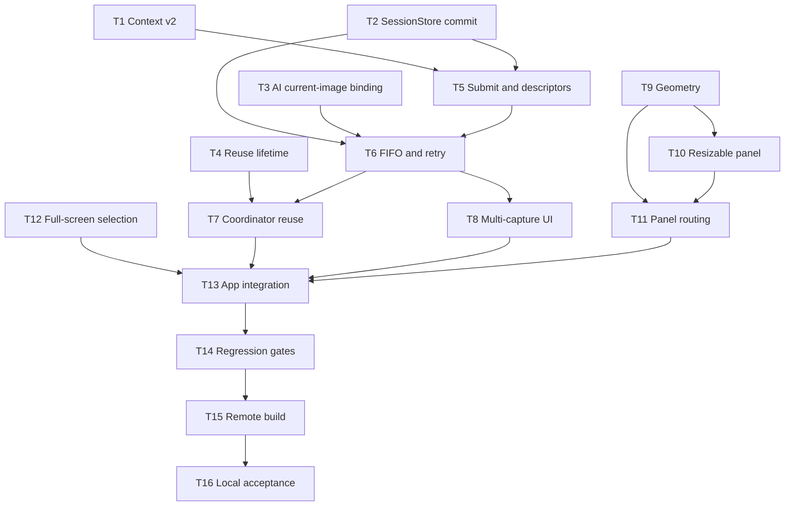

# Peekaboo 悬浮截图卡连续会话与全屏框选 · 执行计划

## 1. 基本信息

| 项目 | 内容 |
|---|---|
| 日期 | 2026-09-10 |
| 状态 | 已批准，进入 TDD 实现 |
| 依据 | 已批准的方案 A |
| 开发方式 | TDD；独立改动并行，汇合点串行 |
| 最终交付 | 远程构建 `.app`、本机安装与验收 |

## 2. 任务列表

### T1 · Context v2 多截图存储与兼容迁移

| 字段 | 内容 |
|---|---|
| 描述 | 将单图 Context 升级为多截图 manifest，兼容 v1，并把追加图安全保存到 session 子目录。 |
| 输出 | `Apps/Mac/Peekaboo/Core/ScreenshotConversation/ScreenshotConversationContextStore.swift`；`Apps/Mac/PeekabooTests/Services/ScreenshotConversationContextStoreTests.swift` |
| 验收 | 红测覆盖 v1 解码、v2 追加、受控子目录、全部图片删除、orphan cleanup、权限、超限和写失败回滚；实现后全部转绿。 |
| 前置依赖 | 无 |
| 预估 | 1d |
| 优先级 | P0 |
| 范围 | dev |

### T2 · SessionStore 幂等插入与可失败同步持久化

| 字段 | 内容 |
|---|---|
| 描述 | 新增按固定 ID insert-or-update 消息及 `persistSessionsNow()` throwing 提交边界。 |
| 输出 | `Apps/Mac/Peekaboo/Core/ConversationSession.swift`；`Apps/Mac/PeekabooTests/Services/SessionServiceTests.swift` |
| 验收 | 同 ID 重放不重复、锚点后顺序正确、写盘失败可观察、原有异步保存行为不回归。 |
| 前置依赖 | 无 |
| 预估 | 0.5d |
| 优先级 | P0 |
| 范围 | dev |

### T3 · AI 图片绑定当前截图提示

| 字段 | 内容 |
|---|---|
| 描述 | 新增 `history + currentPrompt + image` 调用边界，禁止图片隐式绑定第一条 user turn。 |
| 输出 | `Core/PeekabooCore/Sources/PeekabooAutomation/Services/AI/PeekabooAIService.swift`；`Core/PeekabooCore/Tests/PeekabooTests/PeekabooAIServiceConversationTests.swift` |
| 验收 | 两轮以上历史中，图片只出现在当前 prompt；历史 prompt 不重复；无图追问保持原行为。 |
| 前置依赖 | 无 |
| 预估 | 0.5d |
| 优先级 | P0 |
| 范围 | dev |

### T4 · 截图会话复用生命周期

| 字段 | 内容 |
|---|---|
| 描述 | 新增进程内 lifetime，明确卡片打开复用、关闭/Esc/新会话切断的唯一状态源。 |
| 输出 | `Apps/Mac/Peekaboo/Core/ScreenshotConversation/ScreenshotConversationLifetime.swift`；`Apps/Mac/PeekabooTests/Services/ScreenshotConversationLifetimeTests.swift` |
| 验收 | bind 后返回同一 session；end 后为空；App 重启默认为空；重复 end 幂等。 |
| 前置依赖 | 无 |
| 预估 | 0.5d |
| 优先级 | P0 |
| 范围 | dev |

### T5 · 截图提交、追加与可观察 Descriptor

| 字段 | 内容 |
|---|---|
| 描述 | 在 Service 中实现 create-or-append submission、v1 二阶段迁移与多截图只读状态接口。 |
| 输出 | `Apps/Mac/Peekaboo/Core/ScreenshotConversation/ScreenshotConversationService.swift`；`Apps/Mac/PeekabooTests/Services/ScreenshotConversationServiceTests.swift` |
| 验收 | 合法复用只产生一个 session；失效 session 自动新建；capture ID 与 user message ID 一致；UI descriptor 按序可观察。 |
| 前置依赖 | T1、T2 |
| 预估 | 1d |
| 优先级 | P0 |
| 范围 | dev |

### T6 · 每会话 FIFO、失败暂停与幂等重试

| 字段 | 内容 |
|---|---|
| 描述 | 实现单会话串行 drain、固定 assistant ID、失败暂停、重试/跳过和崩溃 reconcile。 |
| 输出 | `Apps/Mac/Peekaboo/Core/ScreenshotConversation/ScreenshotConversationService.swift`；`Apps/Mac/PeekabooTests/Services/ScreenshotConversationServiceTests.swift` |
| 验收 | 三张图按序请求；第二张不会提前执行；失败后暂停；重试或跳过再继续；崩溃边界不重复回答；skipped prompt 不进入后续 AI history。 |
| 前置依赖 | T2、T3、T5 |
| 预估 | 1d |
| 优先级 | P0 |
| 范围 | dev |

### T7 · Coordinator 改为复用提交且不取消前图

| 字段 | 内容 |
|---|---|
| 描述 | 用 lifetime + submission 替换每次新建会话及取消旧分析的现有分支。 |
| 输出 | `Apps/Mac/Peekaboo/Core/ScreenshotConversation/CaptureAndAskCoordinator.swift`；`Apps/Mac/PeekabooTests/Services/CaptureAndAskCoordinatorTests.swift` |
| 验收 | 卡片打开连续三次截图复用 session；分析中可再次框选；前一请求不取消；关闭后下一张新建。 |
| 前置依赖 | T4、T6 |
| 预估 | 0.5d |
| 优先级 | P0 |
| 范围 | dev |

### T8 · 多截图卡片 UI 与精确操作

| 字段 | 内容 |
|---|---|
| 描述 | 增加截图序号/缩略项、逐图状态、精确重试/跳过和“新会话”入口。 |
| 输出 | `Apps/Mac/Peekaboo/Features/ScreenshotConversation/FloatingScreenshotChatView.swift`；`Apps/Mac/Peekaboo/Features/ScreenshotConversation/ScreenshotConversationComponents.swift`；`Apps/Mac/PeekabooTests/Views/FloatingScreenshotChatStateTests.swift`；`Apps/Mac/PeekabooTests/Views/ScreenshotConversationComponentsTests.swift` |
| 验收 | 三张截图按序显示并默认选中最新；状态实时刷新；失败按钮只作用目标 capture；busy 时文本输入保持禁用。 |
| 前置依赖 | T6 |
| 预估 | 1d |
| 优先级 | P0 |
| 范围 | dev |

### T9 · Panel 几何归一化与持久化

| 字段 | 内容 |
|---|---|
| 描述 | 增加 window-frame 纯函数和 UserDefaults geometry store，覆盖负坐标、跨屏、空屏幕与非法值。 |
| 输出 | `Apps/Mac/Peekaboo/Core/ScreenshotConversation/FloatingPanelPlacement.swift`；`Apps/Mac/Peekaboo/Core/ScreenshotConversation/FloatingPanelGeometryStore.swift`；`Apps/Mac/PeekabooTests/Services/FloatingPanelPlacementTests.swift`；`Apps/Mac/PeekabooTests/Services/FloatingPanelGeometryStoreTests.swift` |
| 验收 | `360×260` 最小值、动态屏幕最大值、16pt 边距、跨屏最大交集和显示器丢失均得到确定结果；UserDefaults round-trip、损坏值忽略、空屏不回写；全部算法输入输出统一为 window frame。 |
| 前置依赖 | 无 |
| 预估 | 0.5d |
| 优先级 | P0 |
| 范围 | dev |

### T10 · 原生可缩放 Panel 与标题拖动区

| 字段 | 内容 |
|---|---|
| 描述 | 把 borderless 卡片改成隐藏标题栏的 resizable panel，并用原始 NSEvent 驱动系统拖动和双击复位。 |
| 输出 | `Apps/Mac/Peekaboo/Core/ScreenshotConversation/FloatingScreenshotChatPanel.swift`；`Apps/Mac/Peekaboo/Features/ScreenshotConversation/FloatingPanelDragHandle.swift`；`Apps/Mac/Peekaboo/Features/ScreenshotConversation/FloatingScreenshotChatView.swift` 中仅自适应 frame 与 DragHandle 集成；`Apps/Mac/PeekabooTests/Services/FloatingScreenshotChatPanelControllerTests.swift`；`Apps/Mac/PeekabooTests/Views/FloatingScreenshotChatStateTests.swift` |
| 验收 | styleMask、按钮隐藏和 min/max size 正确；四边四角可缩放；拖动区不覆盖按钮；双击恢复 `460×600pt`。 |
| 前置依赖 | T9 |
| 预估 | 0.5d |
| 优先级 | P0 |
| 范围 | dev |

### T11 · Panel Controller 二维路由与几何回调

| 字段 | 内容 |
|---|---|
| 描述 | 接入 move/resize/screen 回调、frame 防抖持久化及跨显示器显式重路由。 |
| 输出 | `Apps/Mac/Peekaboo/Core/ScreenshotConversation/FloatingScreenshotChatPanelController.swift`；`Apps/Mac/PeekabooTests/Services/FloatingScreenshotChatPanelControllerTests.swift` |
| 验收 | 同屏连续截图 frame 不跳、跨屏先隐藏再定位；`windowDidMove` 防抖后执行 normalize→递归保护 setFrame→save；`windowDidEndLiveResize` 立即归一化保存；`windowWillResize` 限制实时尺寸；换屏/屏幕参数变化更新 maxSize；程序化 setFrame 不递归回写。 |
| 前置依赖 | T9、T10 |
| 预估 | 1d |
| 优先级 | P0 |
| 范围 | dev |

### T12 · 标准全屏 Space 非激活框选

| 字段 | 内容 |
|---|---|
| 描述 | 去除框选前应用激活，使用鼠标所在屏为 key 的非激活全屏辅助面板。 |
| 输出 | `Apps/Mac/Peekaboo/Core/ScreenshotConversation/CaptureSelectionController.swift`；`Apps/Mac/PeekabooTests/Services/CaptureSelectionTests.swift` |
| 验收 | 面板不可成为 main、可成为 key、具备目标 collection behavior；代码路径不调用 `NSApp.activate`；多屏初始 key 选择正确。 |
| 前置依赖 | 无 |
| 预估 | 0.5d |
| 优先级 | P0 |
| 范围 | dev |

### T13 · App 装配、关闭边界与端到端回归

| 字段 | 内容 |
|---|---|
| 描述 | 装配 lifetime、Service、Presenter 和 UI 回调，并覆盖完整连续截图生命周期。 |
| 输出 | `Apps/Mac/Peekaboo/PeekabooApp.swift`；`Apps/Mac/PeekabooTests/Services/ScreenshotConversationEndToEndTests.swift`；必要的 callback relay tests |
| 验收 | `截图1→回答1→截图2→回答2→追问` 在一个 session；关闭/新会话后新建；普通会话与现有 Markdown 不回归。 |
| 前置依赖 | T7、T8、T11、T12 |
| 预估 | 1d |
| 优先级 | P0 |
| 范围 | dev |

### T14 · 定向测试、格式与安全回归

| 字段 | 内容 |
|---|---|
| 描述 | 运行所有相关测试、格式和 lint，并修复仅由本轮变更引起的问题。 |
| 输出 | 测试/格式结果；必要的最小修复及对应回归测试 |
| 验收 | Mac 定向测试、PeekabooCore AI 测试、`git diff --check`、SwiftFormat、SwiftLint 全部通过或记录工具链客观限制。 |
| 前置依赖 | T13 |
| 预估 | 0.5d |
| 优先级 | P0 |
| 范围 | dev |

### T15 · 远程 Xcode 构建与 artifact

| 字段 | 内容 |
|---|---|
| 描述 | 推送 feature branch，运行远程测试和 Xcode Debug build，下载可安装 App。 |
| 输出 | 绿色 CI run；构建 artifact |
| 验收 | CI 全绿；产物 bundle ID、版本、架构和签名状态可核对；App 能在目标 Mac 启动。 |
| 前置依赖 | T14 |
| 预估 | 0.5d |
| 优先级 | P0 |
| 范围 | test |

### T16 · 本机安装与交互验收

| 字段 | 内容 |
|---|---|
| 描述 | 保留上一版回滚副本，安装新 App，完成连续截图、拖缩和全屏 Space 实机验证。 |
| 输出 | `/Applications/Peekaboo.app`；验收记录 |
| 验收 | proposal 的 10 条验收标准逐项通过，重点覆盖三类全屏 App 各 3 次以及 Space A→全屏 B→返回 A 的隐私路由。 |
| 前置依赖 | T15 |
| 预估 | 0.5d |
| 优先级 | P0 |
| 范围 | test |

## 3. 依赖图

并行批次：

- Wave 1：T1、T2、T3、T4、T9、T12 可独立启动。
- Wave 2：T5 与 T10 并行。
- Wave 3：T6 与 T11 并行。
- Wave 4：T7 与 T8 并行。
- Wave 5：T13 → T14。
- Wave 6：T15 → T16。

## 4. 测试策略

### 4.1 TDD 单元测试

- T1–T13 均先写失败测试，再做最小实现，最后重构。
- 数据/队列使用可控 clock、临时目录和可挂起 analyzer，禁止依赖真实 Provider。
- 窗口逻辑尽量抽成可注入边界，使 AppKit 属性与几何算法可独立验证；不可自动化的 Space 行为只在 T16 判定。
- AI builder 用结构化请求 fixture 验证图片所在 message，不发真实网络请求。

### 4.2 集成测试

- 用内存 SessionStore + 临时 ContextStore + 可控 analyzer 覆盖完整连续截图。
- 验证同一 session 的 prompt/answer 最终逻辑顺序和重启 reconcile。
- 验证普通会话、单张旧截图会话、Markdown 和模型固定行为不回归。

### 4.3 端到端与实机测试

- 远程 Xcode build 负责真实 target 编译和自动化测试。
- 用户 Mac 负责 TCC 权限、全局快捷键、真实 Spaces、全屏 App、多显示器和窗口拖缩。
- 实机测试使用当前已授权的安装路径，避免同时运行构建目录副本造成 TCC 身份混淆。

## 5. 回滚点

| 锚点 | 完成任务 | 可回滚内容 | 数据处理 |
|---|---|---|---|
| R1 | T1–T3 | 多图存储、SessionStore 提交、AI 图片绑定 | v2 保留 v1 顶层字段；追加图位于旧版不扫描的子目录 |
| R2 | T4–T8 | 生命周期、FIFO、Coordinator、UI | 回退代码后旧版显示第一张图和文本；追加图不被清理 |
| R3 | T9–T12 | 窗口几何、resize、全屏框选 | 删除 geometry UserDefaults key 即恢复默认位置；数据不受影响 |
| R4 | T13–T15 | 集成、测试、远程 artifact | 保留当前已安装 App，未覆盖前不影响用户使用 |
| R5 | T16 | 本机安装 | 恢复安装前备份的上一版 App；不清除 Application Support 数据 |

## 6. 多 Agent 文件所有权

实现阶段按独立边界分工，所有 Agent 都必须保留其他人的改动：

- 数据 Agent：T1、T2，只负责 ContextStore/SessionStore 及其测试。
- AI Agent：T3，只负责 PeekabooAIService 当前图片绑定及其测试。
- 窗口 Agent：T9–T11，负责 geometry、panel、controller 及其测试；T10 可先修改 `FloatingScreenshotChatView.swift` 的自适应 frame 与 DragHandle 集成区域。
- 主 Agent：T4–T8、T12–T16，负责生命周期、编排、多截图 UI、全屏框选、装配、整合和交付；T8 在 T10 完成后串行追加同一 View 的多截图 UI。

共享文件进入串行阶段后再修改，避免 `ScreenshotConversationService.swift`、`PeekabooApp.swift` 和 UI 文件产生并行冲突。

## 7. 计划批准记录

- 2026-09-10：tech-design 方案 A 已获用户“执行”批准。
- 2026-09-10：用户回复“确认执行”，本执行计划获批准，已进入 `tdd-implementation`。
