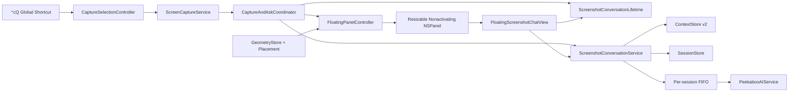
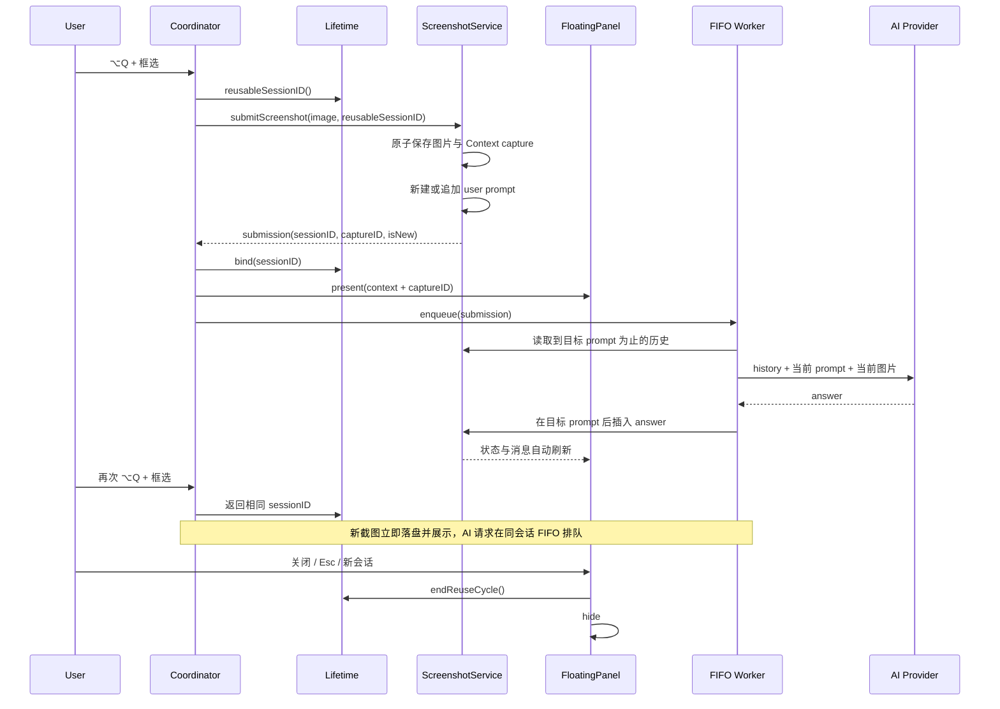
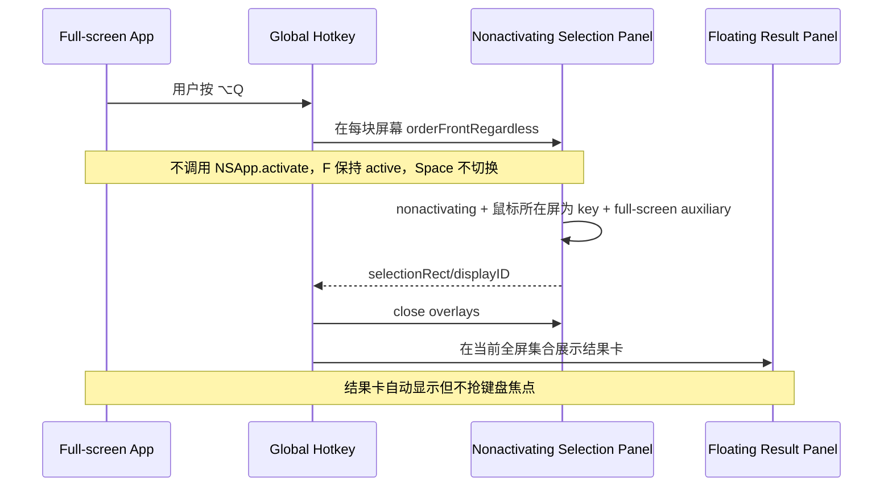
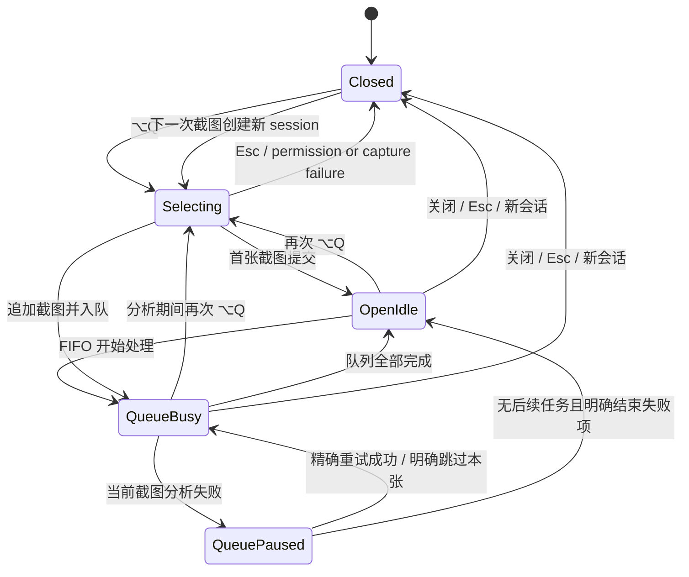
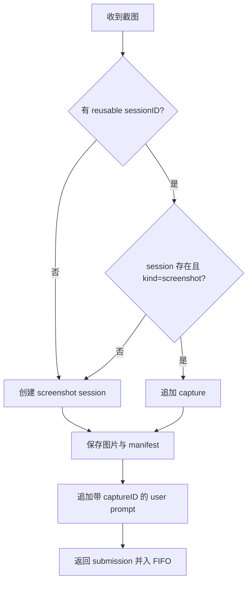

# Peekaboo 悬浮截图卡连续会话与全屏框选 · 技术方案

## 1. 版本与参与人员

| 项目 | 内容 |
|---|---|
| 版本 | v1.0 |
| 日期 | 2026-09-10 |
| 状态 | 已批准，进入执行计划 |
| 产品/验收 | 用户本人 |
| 方案与实现 | Codex |
| Profile | full（涉及截图编排、持久化、AI 请求和窗口系统四个模块） |

## 2. 背景与目标

### 2.1 当前实现

当前链路为：

```text
⌥Q
  → CaptureSelectionController 激活 Peekaboo 并创建全屏选区面板
  → CaptureAndAskCoordinator 截图
  → ScreenshotConversationService.createConversation 每次创建新会话
  → FloatingScreenshotChatPanelController 展示唯一悬浮卡
  → ScreenshotConversationService.analyze 分析单张图片
```

已确认的关键约束：

- `CaptureAndAskCoordinator.prepareCapture` 每次都调用 `createConversation`，随后取消上一会话分析，因此连续截图必然拆成多个会话。
- `ScreenshotConversationContext` 只有一个 `imageFileName`，存储模型天然是一会话一张图。
- `ScreenshotConversationService.analyze` 通过“是否已有 assistant 消息”判断是否带图，只支持首张图片。
- AI 消息构造器当前把图片绑定到裁剪后的第一条 user turn。第二张图片若直接携带完整历史，会错误绑定到第一张截图提示。
- `CaptureSelectionFocusController` 在创建框选面板前调用 `NSApp.activate(ignoringOtherApps: true)`；这会抢占焦点，并可能将用户从其他 App 的全屏 Space 切走。
- 结果卡是 `.borderless`，没有 `.resizable`；SwiftUI 根视图宽度固定为 `460pt`，标题栏拖动只处理 X 轴。

### 2.2 目标

- 卡片打开期间，所有新截图复用当前会话并按截图顺序串行分析。
- 每张图片只在其对应分析请求中上传一次，后续纯文本追问不重新携带历史图片。
- 卡片支持二维拖动、原生四边/四角缩放、位置尺寸持久化和多显示器纠偏。
- 标准 macOS 全屏应用中触发 `⌥Q` 时不切换 Space，并在当前全屏画面完成框选与展示。
- 保持旧截图会话、普通会话、Provider/模型配置和 Markdown 渲染兼容。

## 3. 方案对比与选型

### 3.1 连续截图数据与请求编排

#### 方案 A：截图 Context v2 + 消息 ID 关联 + Service FIFO（推荐）

核心思路：截图元数据继续留在 Mac App 专属 `ScreenshotConversationContextStore` 中。一条截图记录使用与其 user prompt 相同的 UUID，AI 服务按该 ID 精确取图和截取历史；`ScreenshotConversationService` 为每个会话维护 FIFO 队列。

优点：

- 不污染共享 `PeekabooAutomationKit` 的通用 `ConversationMessage` 协议。
- 图片、提示和重试目标有稳定的一一映射。
- 可兼容旧的一会话一图 Context。
- 同一会话最多一个在途分析，天然保证回答顺序。

缺点：

- `sessions.json` 与截图 manifest 仍是两个文件，无法获得数据库事务级原子性。
- 需要增加启动时 reconcile，修复极端崩溃产生的半提交记录。

风险等级：中。

#### 方案 B：给共享 ConversationMessage 增加截图附件

核心思路：在共享 Core 模型的每条消息中增加 `screenshotAttachment`，图片路径或资源 ID 直接随消息持久化。

优点：消息与截图关系直观，UI 遍历单一模型即可展示。

缺点：把 Mac App 私有文件存储语义扩散到 CLI、Core、普通会话和 Codable 协议；旧 Context 仍要迁移，影响面明显更大。

风险等级：高。

选型：选择方案 A。

### 3.2 悬浮卡拖动与缩放

#### 方案 A：透明标题栏语义 + AppKit 原生 resize（推荐）

使用带 `.titled`、`.resizable`、`.nonactivatingPanel`、`.fullSizeContentView` 的 `NSPanel`，隐藏系统标题和按钮，保留自定义半透明卡片。AppKit 负责四边/四角命中、光标和实时缩放；标题拖动使用 `NSWindow.performDrag(with:)`。

优点：复用系统成熟行为，跨屏拖动、Retina、光标和辅助功能更可靠。

缺点：需要处理隐藏标题栏与自定义圆角的视觉细节。

风险等级：低到中。

#### 方案 B：保持 borderless 并手写八方向缩放

优点：外观完全自定义。

缺点：需要自行实现八个命中区、锚点坐标、光标、Retina 和多屏负坐标；容易与滚动、按钮和拖动手势冲突。

风险等级：中到高。

选型：选择方案 A。

### 3.3 全屏 Space 框选

#### 方案 A：全程非激活框选面板（推荐）

去除 `NSApp.activate` 和结束后的前台 App 恢复；框选面板改为 `.nonactivatingPanel`，允许成为 key 但不能成为 main，并加入其他 App 的全屏窗口集合。结果卡同样允许加入其他 App 全屏集合。

优点：保留现有自定义框选、精确选区坐标和多屏能力；不切换用户 Space。

缺点：不同 macOS 版本对非激活 panel 的 `Esc` 路由需要实机验证。

风险等级：中。

#### 方案 B：调用系统 `/usr/sbin/screencapture -i`

优点：系统原生框选的全屏兼容性较高。

缺点：难以稳定获得 `selectionRect` 和 `displayID`，样式不可控，结果卡定位需要推断，还引入子进程与临时文件清理。

风险等级：中到高。

选型：选择方案 A；仅当目标系统实机证明方案 A 无法接收鼠标事件时，再把方案 B 作为回退，而不是首发双实现。

## 4. 关键决策

| ID | 决策 | 理由 |
|---|---|---|
| D1 | 不修改共享 `ConversationMessage` 附件协议 | 把变更限制在 Mac 截图功能内 |
| D2 | `captureID == 对应 user prompt 的 messageID` | 用一个稳定 ID 完成图片、提示、状态和重试关联 |
| D3 | 每会话单 FIFO 分析器；单项失败时暂停 | 保证 `截图1 → 回答1 → 截图2 → 回答2` 的真实上下文顺序 |
| D4 | AI 图片明确绑定“当前截图提示”，不再隐式绑定第一条 user turn | 避免第二张图被错误附到第一条提示 |
| D5 | 关闭卡片只结束复用周期，不取消已经入队的分析 | 关闭是 UI/上下文边界，不等于删除历史或浪费已提交请求 |
| D6 | 使用原生 resizable panel，不手写 resize handles | 降低窗口交互和多屏回归风险 |
| D7 | 框选过程不激活 Peekaboo | 避免全屏 Space 切换和焦点往返 |
| D8 | 结果卡以“只出现在触发截图的当前 Space”为路由约束 | AppKit 属性不能单独证明该结果，必须通过复用窗口重路由和实机验收共同保证 |

## 5. 系统设计

### 5.1 架构图



### 5.2 连续截图核心流程



### 5.3 全屏 Space 流程



### 5.4 状态流转



## 6. 数据设计

### 6.1 Context v2

```swift
struct ScreenshotConversationContext: Codable, Sendable {
    let schemaVersion: Int
    let sessionID: UUID
    let imageFileName: String      // v1 兼容字段，指向第一张图
    let createdAt: Date            // v1 兼容字段
    var captures: [ScreenshotCapture]
}

struct ScreenshotCapture: Codable, Identifiable, Sendable {
    let id: UUID                   // 同时作为 user prompt message ID
    let imageFileName: String      // 第一张为 sessionID.png；追加图位于 sessionID/captureID.png
    let createdAt: Date
    var analysisState: ScreenshotCaptureAnalysisState
    let assistantMessageID: UUID   // 请求前预分配，用于 answer insert-or-update 幂等
}

enum ScreenshotCaptureAnalysisState: String, Codable, Sendable {
    case pending
    case analyzing
    case ready
    case failed
    case skipped
}
```

Context JSON 示例：

```json
{
  "schemaVersion": 2,
  "sessionID": "11111111-1111-1111-1111-111111111111",
  "imageFileName": "11111111-1111-1111-1111-111111111111.png",
  "createdAt": "2026-09-10T10:00:00Z",
  "captures": [
    {
      "id": "22222222-2222-2222-2222-222222222222",
      "imageFileName": "11111111-1111-1111-1111-111111111111.png",
      "createdAt": "2026-09-10T10:00:00Z",
      "analysisState": "ready",
      "assistantMessageID": "33333333-3333-3333-3333-333333333333"
    }
  ]
}
```

### 6.2 兼容与迁移

- 使用自定义 Decoder：v1 `{sessionID,imageFileName,createdAt}` 先解为 `schemaVersion=1`、`captures=[]` 的 legacy context；不能依赖 synthesized Codable。
- 随后由 `ScreenshotConversationService` 结合 `SessionStore` 做第二阶段迁移：把旧图映射到会话第一条 user message；若其后紧邻已有 assistant，则复用该 message ID 并标记 ready；若没有 assistant，则预分配新 assistant ID 并标记 failed 以允许精确重试。保留旧文件名，不做高风险 rename。若找不到 user message，则保留为 `legacy-unlinked` 并显示不可重试错误，不删除原图。
- v2 继续写顶层 `imageFileName/createdAt`，旧版本 App 回滚后仍能读取第一张图并展示文本历史。
- 第一张图片继续放在旧版识别的 images 根目录；第 2 张起放在受控的 `images/<sessionID>/<captureID>.png` 子目录。旧版清理器只扫描根目录 PNG，不会误删追加图片。相对路径只接受精确的 UUID session 目录和 UUID PNG 文件名，拒绝任意层级与路径分隔符注入。
- `removeContext`、orphan cleanup 和引用扫描必须遍历全部 captures。
- 启动 reconcile：移除 v2 中无对应 user message 的半提交 capture；legacy-unlinked 不自动删除。对全部非 skipped capture 核对预分配的 `assistantMessageID`：对应消息已存在则标为 `ready`；不存在时，即便 manifest 原为 ready 也降为 `failed`，由用户决定重试，不在启动时静默上传。
- 单图 50 MB、manifest 64 KB 的现有限制继续生效；新 manifest 编码超限时回滚本次新增图片。

### 6.3 数据库

无数据库、无 DDL。全部数据继续存放在用户本机 Application Support 目录，目录权限 `0700`，图片和 JSON 文件权限 `0600`。

## 7. 内部接口设计

### 7.1 截图会话生命周期

```swift
@MainActor
final class ScreenshotConversationLifetime {
    private(set) var reusableSessionID: String?
    func bind(sessionID: String)
    func endReuseCycle()
}
```

| 方法 | 参数 | 返回 | 语义 |
|---|---|---|---|
| `bind` | `sessionID` | 无 | 悬浮卡打开后设置当前可复用会话 |
| `endReuseCycle` | 无 | 无 | 关闭、Esc 或“新会话”时清空；不删除、不取消历史任务 |

### 7.2 截图提交与分析

```swift
struct ScreenshotSubmission: Sendable {
    let sessionID: String
    let captureID: UUID
    let index: Int
    let isNewSession: Bool
}

func submitScreenshot(
    imageData: Data,
    reusing sessionID: String?) throws -> ScreenshotSubmission

func enqueueAnalysis(_ submission: ScreenshotSubmission)
func retryCapture(sessionID: String, captureID: UUID)
func skipFailedCapture(sessionID: String, captureID: UUID)
func imageData(sessionID: String, captureID: UUID) throws -> Data?
func captures(sessionID: String) -> [ScreenshotCaptureDescriptor]
```

`ScreenshotConversationService` 保持 `@Observable`；`captures(sessionID:)` 返回截图顺序、当前状态和缩略图读取标识，供主窗口与悬浮卡共同展示。`submitScreenshot` 在落盘前同时预分配 `captureID` 和 `assistantMessageID`。

`SessionStore` 增加两个窄接口：

```swift
func insertOrUpdateMessage(
    _ message: ConversationMessage,
    after anchorMessageID: UUID,
    in sessionID: String)
func persistSessionsNow() throws
```

前者按固定 message ID 幂等插入或更新；后者把现有同步写盘实现改为可报告失败的提交边界，原有异步便利方法可以继续包装调用。

`submitScreenshot` 的决策：



### 7.3 AI 图片绑定接口

新增截图专用调用边界，显式拆分历史和当前带图提示：

```swift
func analyzeImageTurn(
    imageData: Data,
    history: [ConversationTurn],
    currentPrompt: String,
    model: LanguageModel) async throws -> ImageConversationResult
```

该接口只能把图片附到 `currentPrompt`，禁止根据“第一条 user turn”推断图片位置。纯文本追问继续传 `imageData = nil` 的普通历史，不读取任何 capture 文件。

### 7.4 展示上下文

```swift
struct ScreenshotPresentationContext: Sendable {
    let sessionID: String
    let captureID: UUID
    let selectionRect: CGRect
    let displayID: CGDirectDisplayID?
    let isNewSession: Bool
}
```

- 同 session 再次 `present`：更新选中的 capture，不重置窗口尺寸，不折叠用户已经展开的区域。
- 新 session 首次 `present`：绑定新会话，默认选中最新 capture；窗口优先恢复上次合法 frame。
- 截图来自当前卡片所在显示器：保持用户位置和尺寸。
- 截图来自另一显示器：先 `orderOut`，保留尺寸并按新选区在目标显示器重新定位，再 `orderFrontRegardless`；这是全屏/多屏场景保证结果留在触发位置所需的显式重路由。

### 7.5 几何接口

```swift
protocol FloatingPanelGeometryStoring {
    func loadFrame() -> CGRect?
    func saveFrame(_ frame: CGRect)
}

enum FloatingPanelGeometry {
    static func normalizedFrame(
        _ frame: CGRect,
        screens: [CGRect],
        fallbackScreen: CGRect?,
        margin: CGFloat = 16) -> CGRect?
}
```

持久化 key：`peekaboo.floatingScreenshotChat.frame.v1`。返回 `nil` 表示当前没有任何可用屏幕，调用方必须保留现有 frame 和保存值，等待屏幕参数恢复。Panel 的几何事件通过 `windowDidMove`（防抖）、`windowDidEndLiveResize`、`windowDidChangeScreen` 和 `windowWillResize` 回调到 controller；测试替身必须能触发这些事件。

### 7.6 错误定义

| 错误 | 用户行为 | 系统处理 |
|---|---|---|
| `invalidSessionID/sessionNotFound` | 当前复用会话已失效 | 自动创建新截图会话，不覆盖旧文件 |
| `captureNotFound/imageContextMissing` | 某张原图丢失 | 对应截图项显示失败，允许重新截图 |
| `fileTooLarge/contextTooLarge` | 截图或 manifest 超限 | 本次提交失败并回滚新文件，旧会话继续可用 |
| `sessionPersistenceFailed` | 回答已返回但会话写盘失败 | 不把 capture 标为 ready；保留固定 assistant ID，提示重试并由 reconcile 防重复 |
| `requestAlreadyQueued` | 重复点击重试 | 幂等忽略，不产生第二次上传 |
| Provider/鉴权/限流错误 | AI 无法回答 | 对应 capture 标记失败并暂停本会话 FIFO；提供重试与“跳过本张并继续”，不自动改模型 |
| key panel 的 responder 链未处理 `Esc` | 无法键盘取消 | 启用仅在 panel 已成为 key 时工作的本地 key monitor，结束必释放 |
| 全屏 overlay 无法成为 key | 首次 `Esc` 无法送达 | 判定方案 A 实机失败；不使用无法吞事件的全局 monitor 伪装成功，转入系统截图兜底评估 |

## 8. 窗口实现

### 8.1 可缩放结果卡

`FloatingScreenshotChatPanel` 使用：

```swift
styleMask = [.titled, .resizable, .nonactivatingPanel, .fullSizeContentView]
titleVisibility = .hidden
titlebarAppearsTransparent = true
minSize = CGSize(width: 360, height: 260)
maxSize = targetVisibleFrame.insetBy(dx: 16, dy: 16).size
collectionBehavior = [.moveToActiveSpace, .canJoinAllApplications, .fullScreenAuxiliary]
```

- 隐藏 close/minimize/zoom 系统按钮，保留现有自定义关闭按钮。
- SwiftUI 根视图移除固定 `460pt` 宽度，使用最小 `360×260pt` 和可扩展布局。
- 所有 placement、持久化和归一化统一使用包含标题栏的 window frame。创建 `.titled` panel 时先用 `.zero` contentRect，再用 `setFrame(normalizedWindowFrame, display: false)` 设置最终 frame，不能把旧 borderless 的 `contentRect == frame` 假设带过来。
- 标题区域新增不覆盖按钮的 `NSViewRepresentable` 拖动区：在原始 `mouseDown(with:)` 中，双击恢复 `460×600pt`，单击把原始 `NSEvent` 传给 `NSWindow.performDrag(with:)`。SwiftUI `DragGesture` 不再承担窗口拖动。
- 首次无保存 frame 时按选区邻近定位；后续恢复保存值。
- panel 自身作为 `NSWindowDelegate`/几何事件代理：`windowDidMove` 的同一个防抖 handler 依次执行 `normalizedFrame → setFrame（递归保护）→ saveFrame`，以此闭环 `performDrag(with:)` 没有结束回调的问题；`windowDidEndLiveResize` 立即归一化并保存，`windowDidChangeScreen` 和屏幕参数变化时更新最大尺寸并重新归一化。`windowWillResize` 按目标屏幕限制 live resize；内部设置 frame 时使用标记避免递归保存。

几何归一化规则：

1. 一般移动/恢复时选择与窗口交集面积最大的显示器；完全无交集时回退本次截图显示器，再回退主屏。跨显示器新截图按上一节显式重路由，不走“保持旧屏”分支。
2. 宽高限制在有效 `360×260pt` 与目标 `visibleFrame - 16pt margin` 之间；极小可用屏幕上，有效 min 逐轴取标准 min 与可用尺寸的较小值，避免 `maxSize < minSize`。
3. 最后同时收敛 X/Y，保证整个卡片可见。
4. 支持负坐标副屏；拖动过程中允许跨屏，拖动结束后才按新屏收敛。
5. 持久化的 x/y/width/height 必须全部 finite 且 width/height > 0，否则忽略。
6. `NSScreen.screens` 暂时为空时不修改当前 frame、不覆盖保存值；等屏幕信息恢复后再收敛。

### 8.2 全屏框选面板

`CaptureSelectionPanel` 使用：

```swift
styleMask = [.borderless, .nonactivatingPanel]
level = .screenSaver
collectionBehavior = [
    .canJoinAllSpaces,
    .canJoinAllApplications,
    .fullScreenAuxiliary,
    .stationary,
    .ignoresCycle,
]
```

- `canBecomeKey = true`，`canBecomeMain = false`。
- 删除 `CaptureSelectionFocusController` 的 Peekaboo 激活和原 App 恢复往返。
- 面板 `orderFrontRegardless` 后，优先把包含 `NSEvent.mouseLocation` 的屏幕对应面板设为 key；鼠标在其他屏幕按下时再把该屏 panel 设为 key。不得固定使用 `NSScreen.screens.last`。
- 本地 `NSEvent` monitor 只能兜底“panel 已成为 key，但 responder 链漏掉 Esc”的情况；若 panel 无法成为 key，本地 monitor 也收不到其他 App 的事件，必须判定实机验收失败。
- 结果卡不使用 `.canJoinAllSpaces`。复用窗口跨 Space/显示器展示时，先 `orderOut`、更新目标 frame/behavior，再 `orderFrontRegardless`，并通过实机验证它只在触发截图的 Space 可见。

Apple 对相关语义的定义：`.nonactivatingPanel` 不激活所属 App；`.fullScreenAuxiliary` 可与全屏窗口显示在同一 Space；`.canJoinAllApplications` 面向可加入其他 App 全屏集合的浮窗和覆盖层。这些属性描述“可加入”能力，不单独构成当前 Space 路由成功的证明。

## 9. 队列、并发与幂等

- 每个 session 只有一个 drain task；队列元素包含唯一 `captureID`。
- `submitScreenshot` 落盘完成后立即返回并展示，队列只保存 ID，不长期持有图片 Data。
- Worker 开始时读取图片；`history` 只包含目标 user prompt 之前的逻辑消息，目标 prompt 单独作为 `currentPrompt` 传入，禁止在两处重复。
- 回答使用预分配的 `assistantMessageID`，通过 `SessionStore.insertOrUpdateMessage(after: captureID)` 幂等写入对应提示后；下一项启动前可以看到前一项回答。
- 结果提交顺序为：先 insert-or-update 固定 ID 的 assistant 消息并调用新增的同步 `persistSessionsNow()`，再把 context 状态写为 ready。现有异步且吞错的保存路径不足以作为提交边界；新方法至少返回成功/失败供 Service 决策。任一阶段崩溃后，启动 reconcile 都以相同 assistant ID 判断 ready/failed，重试不会插入第二条回答。
- `queuedCaptureIDs` 使用 Set 去重；同一 capture 的重试在 pending/analyzing 时幂等忽略。
- 单项失败标记 capture 为 failed 并暂停本 session 队列。用户精确重试成功后继续，或明确选择“跳过本张并继续”；系统不得让后续回答假装使用了实际缺失的上一张答案。
- 明确跳过后，后续 AI history 必须过滤该 capture 对应的 user prompt；不能把一条没有图片和回答的“请分析截图”发送给后续请求。截图项仍保留为 skipped，供本地查看。
- 文本追问在本会话队列 busy 时继续禁用，队列清空后才允许发送，避免文本插入到尚未完成的截图序列中。
- 关闭卡片不取消队列；删除会话时取消该 session drain task，并清除所有图片。

## 10. UI 设计

- 标题栏新增“新会话”按钮；行为是结束复用周期并隐藏卡片，下一次 `⌥Q` 创建新会话。
- 预览区顶部显示 `截图 1`、`截图 2`…缩略项，默认选中最新截图。
- 截图项展示 `等待中 / 分析中 / 已完成 / 失败 / 已跳过`，失败项提供精确到该 capture 的“重试”和“跳过本张并继续”。
- 只解码当前选中大图；缩略图使用下采样缓存，避免多张 PNG 同时占用内存。
- 同会话追加截图时保持卡片的位置、尺寸、滚动策略和用户手动展开状态。
- 若面板当前聚焦，`Esc` 关闭卡片并结束复用周期；框选阶段的 `Esc` 只取消本次框选，不关闭原有卡片或结束当前会话。

## 11. 条件章节

### 11.1 DDMQ 设计

暂不涉及。

### 11.2 环境配置设计

暂不涉及 dev/sim/pre/prod 配置、Apollo、开关或灰度平台。

### 11.3 时间、货币、电话号码

暂不涉及。

## 12. 稳定性设计

### 12.1 系统稳定性

- 每会话单在途请求，避免同一会话并发乱序和图片重复上传。
- 图片在请求开始前才从磁盘读取，请求结束释放 Data。
- Context 和图片使用原子写；manifest 写失败删除本次新图片。
- 启动 reconcile 处理崩溃留下的半提交和中断状态。
- 全屏 Escape monitor 严格绑定选区生命周期，完成、取消和异常路径都释放。

### 12.2 业务稳定性

- 复用会话只由 `ScreenshotConversationLifetime` 决定，不用“最新历史会话”猜测。
- 关闭/新会话是明确边界；重启 App 后不自动恢复开放复用周期。
- 模型继续固定在 session 上；连续截图不能在同一会话内静默切换 Provider。
- 第二张及之后的图片显式绑定各自 prompt，杜绝串图。

### 12.3 资金安全

不涉及资金交易。成本侧通过“每图仅上传一次”和队列去重防止重复计费。

### 12.4 性能评估

- 窗口展示目标：框选层 500 ms 内出现，截图提交后卡片 1 s 内更新。
- 单次 AI 在途：每 session 最多 1 个。
- UI 内存：只展示一张大图；缩略图最长边限制为 320 px 并缓存。
- 持久化：每新增截图写 1 个 PNG 和 1 个小型 JSON manifest；不在 UI 主线程做图片下采样。

### 12.5 新老兼容

- v2 可读 v1；v2 继续写 v1 顶层字段，旧 App 至少可读取第一张截图和完整文本。
- 普通会话 schema 不变。
- 第 2 张起放入 session 子目录，旧 App 的非递归根目录 orphan cleanup 不会扫描或误删；旧 App 会忽略这些图片，重新升级后可恢复识别。

### 12.6 上下游依赖

- 上游：`KeyboardShortcuts`、AppKit Spaces/NSPanel、ScreenCaptureKit 权限。
- 下游：当前 session 固定的 MiniMax 或其他视觉 Provider。
- 不新增网络服务、进程间接口或第三方依赖。

### 12.7 监控与告警

只记录结构化本地日志，不上传截图、提示词、回答、API Key、文件路径或 Provider 响应体：

| 事件/指标 | 级别 | 触发与处理 |
|---|---|---|
| `capture.overlay.presented` | info | 记录耗时、displayID 是否存在，不记录坐标内容 |
| `capture.queued` / `capture.completed` | info | 记录匿名 session/capture 哈希和队列长度 |
| `capture.persistence.failed` | error | 立即显示“保存截图失败”，保留旧会话 |
| `capture.analysis.failed` | error | 截图项显示重试；同会话连续 3 次失败时展示持久错误提示 |
| `capture.queue.depth > 5` | warning | UI 显示等待数量，辅助诊断 Provider 变慢 |
| `overlay.fullscreen.route.failed` | error | 记录窗口/Space 策略标记，提示用户退出全屏后重试 |

## 13. 测试设计

### 13.1 单元测试

- `ContextStoreTests`：v1 两阶段解码、legacy-unlinked 保留、v2 多图追加、session 子目录安全校验、manifest 回滚、全部图片删除、orphan cleanup、文件权限和超限。
- `ScreenshotConversationServiceTests`：同会话追加、关闭后新建、图片只绑目标 prompt、FIFO、失败暂停、重试/跳过后继续、预分配 assistant ID 的崩溃恢复、重复重试幂等、纯文本不带图。
- `CaptureAndAskCoordinatorTests`：复用 lifetime session、不再取消前一张、关闭后新建、选区重入保护。
- `FloatingPanelGeometryTests`：window frame/content rect 语义、二维边界、负坐标、跨屏最大交集、空屏幕列表、断开显示器、推荐尺寸恢复、非法持久化值。
- `FloatingPanelControllerTests`：复用 panel 保持 frame、动态 min/max size、move 防抖结束后完全可见并保存归一化 frame、resize 结束持久化、同屏保持、跨屏显式重路由、dismiss 后几何保留。
- `CaptureSelectionPanelTests`：nonactivating、key/main、全屏 collection behavior、鼠标所在屏初始 key；依赖注入验证框选链路不调用应用激活。
- `AIMessageBuilderTests`：图片绑定当前截图提示而不是第一条 user turn。

### 13.2 远程构建门禁

- Mac App 定向 Swift Tests。
- `pnpm run lint`。
- `pnpm run format`。
- `pnpm run test:safe`。
- Xcode Mac App Debug build 并产出可安装 artifact。

### 13.3 本机验收

- 连续 3 张截图只有 1 个历史会话，3 个截图项和 3 组按序回答。
- 在第一张仍分析时继续截两张，确认不取消、不串图、不重复上传。
- 上下左右拖动，四边四角缩放，重启恢复，副屏拔插后仍可见。
- Safari、微信和第三个标准 App 全屏各执行 3 次 `⌥Q`；不切 Space，框选和结果卡在当前全屏画面。
- 增加 Space 路由隐私用例：桌面 A 创建卡片 → 切到全屏 B 再截图 → 卡片只在 B 可见 → 切回 A 确认卡片未跨 Space 暴露。
- 框选阶段 `Esc` 只取消本次截图；卡片阶段 `Esc` 关闭并切断复用周期。
- 无权限、断网、无效 Key、限流、图片文件丢失和 App 分析中退出均有可恢复提示。

## 14. 上线与回滚

| 步骤 | 操作 | 验证 | 回滚 |
|---|---|---|---|
| 1 | 在 feature branch 完成测试与远程 Xcode 构建 | CI 全绿、artifact 可启动 | 回退本轮代码提交，不影响当前已安装 App |
| 2 | 安装新 `.app` 到用户 Mac | 权限状态、桌面截图、连续截图通过 | 保留并重新安装上一版 `/Applications/Peekaboo.app` |
| 3 | 执行全屏与多屏本机验收 | 三类全屏 App、拖动缩放、会话复用全部通过 | 回到上一版；v2 顶层兼容字段保证第一张图可读，追加图子目录不被旧版清理器扫描 |
| 4 | 稳定使用后再决定 DMG/签名 | 用户确认 | 本轮不发布，无远端回滚动作 |

## 15. 开放问题与约束验证

| 项目 | Owner | 截止 | 处理 |
|---|---|---|---|
| 非激活 panel 在目标 macOS 的全屏 Space 中能否稳定接收首次鼠标拖拽和 `Esc` | Codex + 用户本机验收 | 本轮安装后 | 自动化只能验证窗口属性，必须做真实全屏验收；panel 已成为 key 但 responder 漏掉 `Esc` 时才启用本地 monitor，panel 无法成为 key 时直接评估系统截图方案 B |
| “显示器具有独立空间”开关的两种状态 | Codex + 用户本机验收 | 本轮安装后 | 若用户系统可切换，则两种模式各验证一次；否则记录当前系统状态 |

知识库说明：项目没有可用的 `kb-search` Skill，也没有 `.claude/templates/tech-design.md`；本方案基于当前源码、现有项目文档、多 Agent 只读分析与 Apple AppKit 官方语义编写。

## 16. 批准记录

- 2026-09-10：proposal 已获用户“执行”批准，进入技术方案。
- 2026-09-10：用户在收到方案 A 与明确批准提示后再次回复“执行”，视为批准方案 A 并进入 execution-plan。
